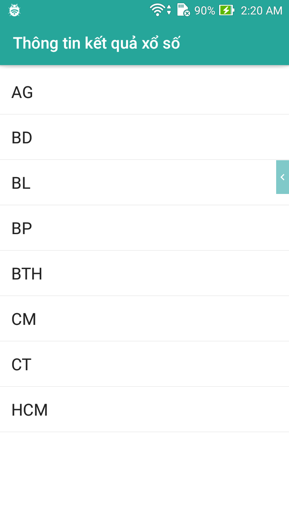
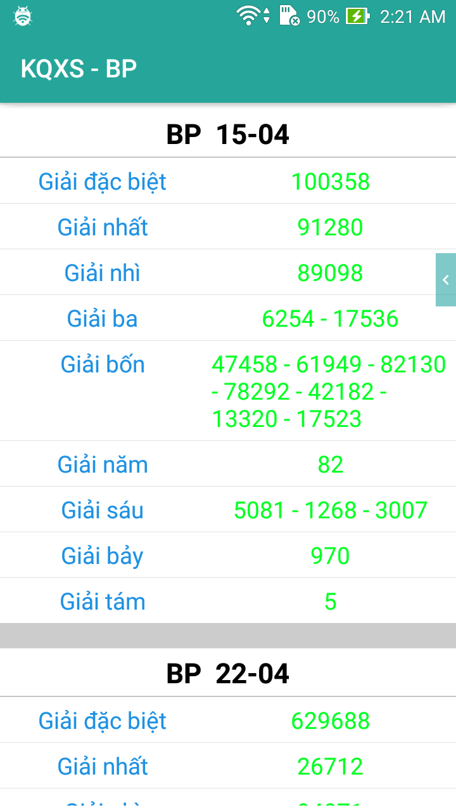

# BT_Môn Phân tích ứng dụng di động (Bonus GK và bài tập cá nhân 2) 
Xây dựng chương trình tra cứu tỷ giá tiền tệ, có chức năng chuyển đổi giữa các loại tiền tệ, có thể sử dụng offline nếu trước đó đã tải dữ liệu thành công

# Tác giả:
  Điểu Vơ Ram Sngrai - K2013 Khoa học và kỹ thuật máy tính - BKU
# ....
# Screen shots

1. Màn hình chính (hiện danh sách xổ số các tỉnh được lấy từ server như đề yêu cầu)

2. Màn hình xem chi tiết

# Screen 1 

# Screen 2

# Screen 3

# Screen 4

